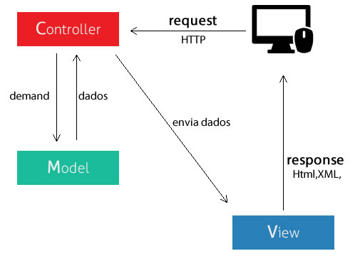

# stream_and_buffer_with_node

install:
node
git
postman
vscode
mysql ---> https://dev.mysql.com/downloads/

start:
npm init

install libs:
npm install express
npm install --save-dev nodemon
npm install --save axios
npm install consign
npm install body-parser
npm install my-sql
npm install moment
npm install file-system --save
npm install faker

# MVC

O padrão MVC é um padrão de arquitetura de software que divide o código em três componentes (Modelo, Controlador e Visão).

## Modelo ou Model

Sua responsabilidade é gerenciar e controlar a forma como os dados se comportam por meio das funções, lógica e regras de negócios estabelecidas.

## Controlador ou Controller

A camada de controle é responsável por intermediar as requisições enviadas pelo View com as respostas fornecidas pelo Model.

## Visão ou View

Essa camada é responsável por apresentar as informações de forma visual ao usuário

EventLoop, o nome de como o Node trabalha com eventos e processos assíncronos de modo geral
O V8, motor que roda o Node, é Single Thread, mas isso não impede que transfiramos eventos assíncronos
para outros lugares e trabalhemos de forma assíncrona assim. Primeiro serão executados os eventos síncronos e depois os assíncronos.
Ele enviará os eventos para serem executados em outra EPI e ela os devolverá para uma fila ou pilha de Callback.

Stream é uma instância da classe EventEmitter, que está dentro do módulo nativo events (eventos).

Todo EventEmitter emite:

o evento “newListener” quando um novo listener é adicionado
e “removeListener” quando um listener é removido.
